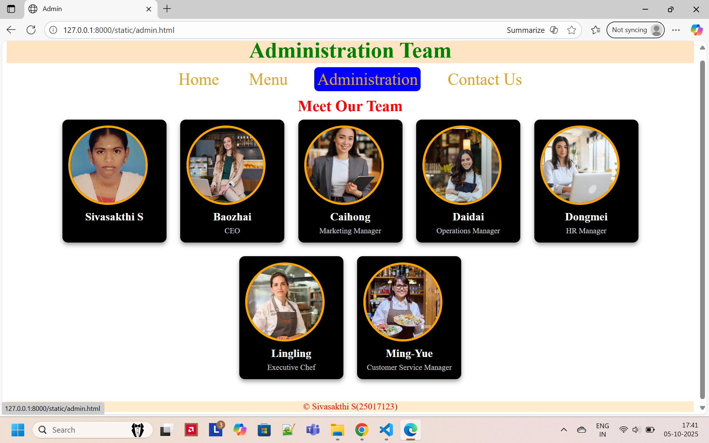

# Ex.07 Restaurant Website
## Date:05-10-2025

## AIM:
To develop a static Restaurant website to display the food items and services provided by them.

## DESIGN STEPS:

### Step 1:
Requirement collection.

### Step 2:
Creating the layout using HTML and CSS.

### Step 3:
Updating the sample content.

### Step 4:
Choose the appropriate style and color scheme.

### Step 5:
Validate the layout in various browsers.

### Step 6:
Validate the HTML code.

### Step 7:
Publish the website in the given URL.

## PROGRAM:
```
home.html

<html>
<head>
    <title>Home</title>
    <link rel="stylesheet" href="home1.css">
</head>
<body>
    <div class="h1">
    <h1>RED  LOTUS  CHINESE  RESTAURANT</h1>
    </div>
    <nav>
    <a href="home.html">Home</a>
    <a href="menu.html">Menu</a>
    <a href="admin.html">Administration</a>
    <a href="contact.html">Contact Us</a>
    </nav>
    <div class="h3">
        <h3>"Experience authentic Chinese flavors blossoming 
            at Red Lotus —where every dish tells a story of 
            tradition and taste"</h3>
    </div>
    <div class="h4">
        <h4>Red Lotus Chinese Restaurant is a popular spot 
            known for its authentic Chinese flavors.The 
            restaurant offers a cozy and elegant ambiance 
            with traditional décor.Its menu features a wide 
            range of dishes, from dim sum to spicy Szechuan 
            specialties.Fresh ingredients and aromatic spices 
            make every meal delightful.</h4>
    </div>
    <div class="ab">
        
    </div>
    <div class="fg">
        &copy; Sivasakthi S(25017123)
    </div>

</body>
</html>

home1.css

body{
    background-image: url(home.png);
    background-size: cover; 
    background-repeat: no-repeat;            
    background-attachment: fixed; 
    background-position: center; 
    margin: 0;
    font-family: Arial, sans-serif;          
}
.h1{
    text-align: center;
    color: blanchedalmond; 
    font-size: 30px;
    margin-top: 5px;
}

nav{
    text-align: center;
    margin-top: 0;
    line-height:5px ;
}

nav a {
    color: white;
    text-decoration: none;
    margin: 0 20px;
    font-size: 30px;
    padding: 5px;
    border-radius: 8px;
    transition: background 0.3s, color 0.3s;
}

nav a:hover {
    background-color: blue;
}

.h3{
    text-align: center;
    color: yellow;  
    font-size: 24px;
    margin-top: 40px;
}
.h4{
    text-align: center;
    color: yellowgreen;  
    font-size: 15px;
    margin-top: 5px;
}
.ab img{
    height: 290px;
    width: 600px;
    align-items: center;
    display: block;
    margin-left: auto;
    margin-right: auto;
    
}
.fg{
    text-align: center;
    margin-top: 45px;
    color: red;
    background-color: blanchedalmond;
    padding: 8px;

}

menu.html

<html>
<head>
    <title>menu</title>
    <link rel="stylesheet" href="menu1.css">
</head>
<body>
    <div class="h3">
        <h3>Our Menu</h3>
    </div>
    <nav>
    <a href="home.html">Home</a>
    <a href="menu.html">Menu</a>
    <a href="admin.html">Administration</a>
    <a href="contact.html">Contact Us</a>
    </nav>

    <section class="menu-section">

        <div class="menu-container">
            <div class="card">
                
                <p>Rou Ja Mo - $30</p>
            </div>
            <div class="card">
                
                <p>Veg Spring Rolls - $8</p>
            </div>
            <div class="card">
                
                <p>Shangyaki - $12</p>
            </div>
            <div class="card">
                
                <p>Spare Ribs - $7</p>
            </div>
            <div class="card">
                
                <p>Cantonesa Dim Sum - $15</p>
            </div>
            <div class="card">
                
                <p>Zhajiangmian- $15</p>
            </div>
            <div class="card">
                
                <p>Chowmin - $26</p>
            </div>
            <div class="card">
                
                <p>Claypot Rice - $24</p>
            </div>
            <div class="card">
                
                <p>Deep Fried Shrimp - $20</p>
            </div>
            <div class="card">
                
                <p>Dongpo Pork - $26</p>
            </div>
            <div class="card">
                
                <p>Dumplings - $16</p>
            </div>
            <div class="card">
                
                <p>Frawn Biriyani - $30</p>
            </div>
            <div class="card">
                
                <p>Liangpi - $20</p>
            </div>
             <div class="card">
                
                <p>Mapo Tofu - $40</p>
            </div>
            <div class="card">
                
                <p>Peking Roasted Duck - $35</p>
            </div>
        </div>
    </section>
    <div class="fg">
        &copy; Sivasakthi S(25017123)
    </div>
</body>
</html>

menu1.css

body{
    background-image: url(back.png);
    background-size: cover; 
    background-repeat: no-repeat;            
    background-attachment: fixed; 
    background-position: center; 
    margin: 0;
    font-family: Arial, sans-serif;          
}
.h3{
    text-align: center;
    color: goldenrod; 
    font-size: 30px;
    margin-top: 0;
}

nav{
    text-align: center;
    margin-top: 0;
    line-height: 0%;
}

nav a {
    color:white;
    text-decoration: none;
    margin: 0 20px;
    font-size: 30px;
    padding: 5px;
    border-radius: 8px;
    transition: background 0.3s, color 0.3s;
   
}

nav a:hover {
    background-color: blue;
}

.menu-section {
    text-align: center;
    padding: 20px;
}

.menu-container {
    display: flex;
    flex-wrap: wrap;
    justify-content: center;
    gap: 50px;
    padding: 20px;
}

.card {
    width: 190px;
    background-color: rgba(0, 0, 0, 0.8);
    border-radius: 10px;
    color: yellow;
    box-shadow: 0 0 10px rgba(0, 0, 0, 0.5);
    transition: transform 0.3s ease;
    display: flex;
    flex-direction: column;
    align-items: center;
}

.card img {
    width: 100%;
    height: 92px;
    border-radius: 10px 10px 0 0;
    object-fit: cover;
}

.card p {
    margin: 4px 0;
    font-weight: bold;
}

.card:hover {
    transform: scale(1.05);
}

.fg{
    text-align: center;
    margin-top: 2px;
    color: red;
    background-color: blanchedalmond;
    padding: 2px;

}

admin.html

<html>
<head>
    <title>Admin</title>
    <link rel="stylesheet" href="admin1.css">
</head>
<body>
    <div class="h1">
    <h1>Administration Team</h1>
    </div>
    <nav>
    <a href="home.html">Home</a>
    <a href="menu.html">Menu</a>
    <a href="admin.html">Administration</a>
    <a href="contact.html">Contact Us</a>
    </nav> 
        <section class="team-section">
        <h2>Meet Our Team</h2>
        <div class="team-container">
             <div class="team-card">
                
                <h3>Sivasakthi S</h3>
            </div>
            <div class="team-card">
                
                <h3>Baozhai</h3>
                <p>CEO</p>
            </div>
            <div class="team-card">
                
                <h3>Caihong</h3>
                <p>Marketing Manager</p>
            </div>
            <div class="team-card">
                
                <h3>Daidai</h3>
                <p>Operations Manager</p>
            </div>
            <div class="team-card">
                
                <h3>Dongmei</h3>
                <p>HR Manager</p>
            </div>
            <div class="team-card">
                
                <h3>Lingling</h3>
                <p>Executive Chef</p>
            </div>
            <div class="team-card">
                
                <h3>Ming-Yue </h3>
                <p>Customer Service Manager</p>
            </div>
        </div>
    </section>
        <div class="fg">
        &copy; Sivasakthi S(25017123)
        </div>
</body>
</html>

admin1.css

.h1{
    text-align: center;
    font-size: 20px;
    color:green; 
    background-color: bisque;

}
nav{
    text-align: center;
    margin-top: 0;
    line-height:5px ;
}

nav a {
    color: goldenrod;
    text-decoration: none;
    margin: 0 20px;
    font-size: 30px;
    padding: 5px;
    border-radius: 8px;
    transition: background 0.3s, color 0.3s;
}

nav a:hover {
    background-color: blue;
}
.team-section {
    margin: 40px 0;
}

.team-section h2 {
     text-align: center;
    font-size: 28px;
    color: red;
    line-height: 2px;
 
}

.team-container {
    display: flex;
    justify-content: center;
    flex-wrap: wrap;
    gap: 25px;
}

.team-card {
    background-color: #000;
    color: white;
    border-radius: 10px;
    width: 166px;
    height: 200px;
    padding: 11px;
    box-shadow: 0 4px 8px rgba(0,0,0,0.4);
    transition: transform 0.3s;
}

.team-card:hover {
    transform: scale(1.05);
}
.team-card img {
    width: 135px;
    height: 135px;
    border-radius: 50%;
    border: 4px solid orange;
    object-fit: cover;

}

.team-card h3 {
    margin: 10px 0 5px;
    font-size: 20px;
    text-align: center;
}

.team-card p {
    font-size: 14px;
    color: #ccc;
     text-align: center;
     line-height: 1px;
}

.fg{
    text-align: center;
    margin-top: 10px;
    color: red;
    background-color: blanchedalmond;
    padding: 8px;
    line-height: 3px;

}

contact.html

<html>
<head>
    <title>Contact us</title>
    <link rel="stylesheet" href="contact1.css">
</head>
<body>
    <div class="h2">
        <h2>Contact Us</h2>
    </div>
    <nav>
    <a href="home.html">Home</a>
    <a href="menu.html">Menu</a>
    <a href="admin.html">Administration</a>
    <a href="contact.html">Contact Us</a>
    </nav>
    <div class="h3">
        <h3>Book A Table</h3>
    </div>
    <div class="contact-section">
    <form>
        <input type="text" name="name" placeholder="Enter Your Full Name" required>
        <input type="email" name="email" placeholder="Enter Your Email" required>
        <input type="tel" name="phone" placeholder="Enter Your Phone Number (optional)">
        <textarea name="message" placeholder="Enter Your Message..." required></textarea>
        <button type="submit">Send Message</button>
    </form>
</div>
 <div class="fg">
        &copy; Sivasakthi S(25017123)
    </div>
</body>
</html>

contact1.css

body{
    background-image: url(chinese.png);
    background-size: cover; 
    background-repeat: no-repeat;            
    background-attachment: fixed; 
    background-position: center; 
    margin: 0;
    font-family: Arial, sans-serif;          
}
.h2{
    text-align: center;
    font-size: 30px;
    color: red; 
    background-color: bisque;

}
nav{
    text-align: center;
    margin-top: 0;
    line-height:5px ;
}

nav a {
    color: white;
    text-decoration: none;
    margin: 0 20px;
    font-size: 30px;
    padding: 5px;
    border-radius: 8px;
    transition: background 0.3s, color 0.3s;
}

nav a:hover {
    background-color: blue;
}
.h3{
    text-align: center;
    font-size: 29px;
    color: gold; 
    line-height: normal;
    

}

   .contact-section {
            padding: 30px;
            max-width: 600px;
            margin: auto;
            background: none;
            border-radius: 10px;
            box-shadow: 0 0 10px rgba(0, 0, 0, 0.1);
        }
        .contact-section h2 {
            text-align: center;
            margin-bottom: 20px;
        }
        .contact-section form {
            display: flex;
            flex-direction: column;
            gap: 15px;
        }
        .contact-section input, .contact-section textarea, .contact-section button {
            padding: 10px;
            font-size: 16px;
            border: 1px solid whitesmoke;
            border-radius: 5px;
        }
        .contact-section textarea {
            resize: none;
            height: 100px;
        }
        .contact-section button {
            background-color: gray;
            color: white;
            cursor: pointer;
        }
.fg{
    text-align: center;
    margin-top: 50px;
    color: red;
    background-color: blanchedalmond;
    padding: 2px;

}

```

## OUTPUT:

 


 

## RESULT:
The program for designing software company website using HTML and CSS is completed successfully.
